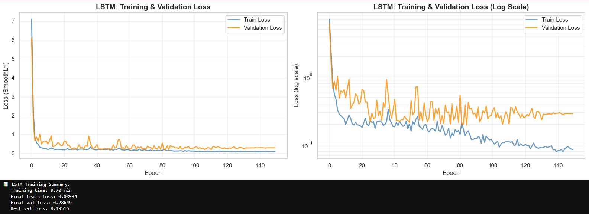
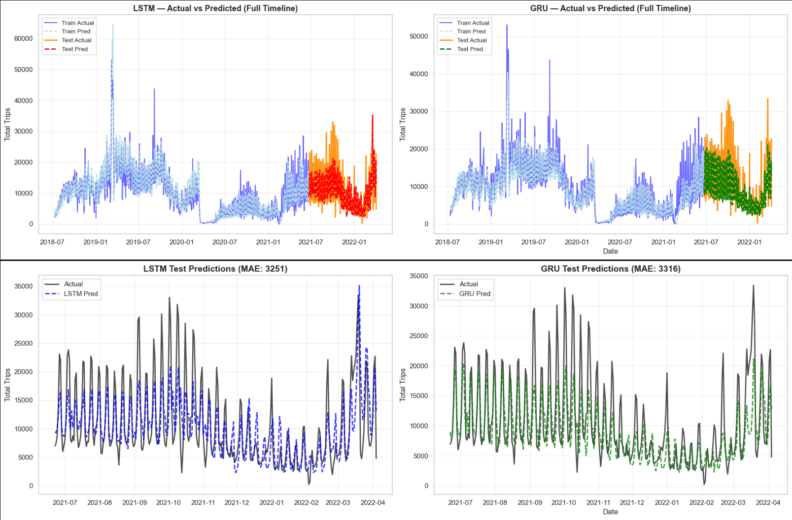
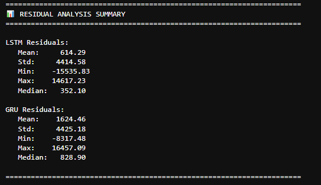
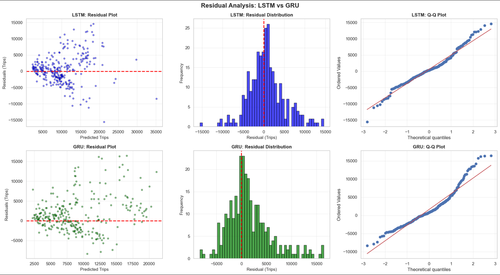

# 🛴 Deep Learning Demand Forecasting for Micromobility Services

[](https://www.python.org/)
[](https://pytorch.org/)
[](LICENSE)

> **Undergraduate Thesis Project**  
> Democritus University of Thrace (D.U.Th.)  
> Department of Electrical and Computer Engineering  
> Supervisor: Prof. Angelos Amanatiadis

Deep learning system for predicting daily demand of shared micromobility vehicles (scooters, bicycles, mopeds) using LSTM and GRU recurrent neural networks. This production-ready forecasting pipeline enables micromobility operators to optimize fleet allocation and operational planning up to 7 days ahead.

---

## 📊 Project Overview

This thesis develops a complete demand forecasting system for micromobility operators, comparing two state-of-the-art recurrent architectures (LSTM vs GRU) on real-world data from Austin, Texas (2018-2022).

### Key Achievements

- 🎯 **17.3% improvement** over naive baseline (LSTM)
- 🧠 **LSTM outperforms GRU** by 2% in test MAE (3,251 vs 3,316 trips)
- 📈 Captures complex temporal patterns: weekly seasonality, trends, and special events
- 🔄 Autoregressive component for robust predictions
- 📦 Production-ready inference pipeline with iterative 7-day forecasting
- 🔬 Comprehensive hyperparameter optimization using Optuna

### Performance Summary

| Model | Test MAE | Test RMSE | sMAPE% | MAPE%@≥10 | Parameters | Training Time |
|-------|----------|-----------|--------|-----------|------------|---------------|
| **LSTM** | **3,251** | **4,457** | **32.0** | **43.3** | 134,995 | 0.70 min |
| **GRU** | 3,316 | 4,714 | 33.4 | 38.8 | 101,379 | 1.31 min |
| Naive (t-1) | 3,931 | 5,770 | 36.0 | 46.6 | - | - |
| Weekly (t-7) | 3,385 | 5,167 | 35.1 | 46.9 | - | - |

*Average daily demand in test period: 10,587 trips*

---

## 🚀 Quick Start

### Prerequisites

```bash
Python 3.8+
PyTorch 2.0+
pandas, numpy, scikit-learn
matplotlib, seaborn
```

### Installation

```bash
# Clone repository
git clone https://github.com/yourusername/micromobility-demand-forecasting.git
cd micromobility-demand-forecasting

# Install dependencies
pip install -r requirements.txt

# Create directory structure
mkdir -p data/raw data/processed models outputs
```

### Download Dataset

1. Visit [Austin Open Data Portal](https://data.austintexas.gov/Transportation-and-Mobility/Shared-Micromobility-Vehicle-Trips/7d8e-dm7r)
2. Download: `Shared_Micromobility_Vehicle_Trips_2018-2022.csv`
3. Place in: `data/raw/`

### Run the Notebook

```bash
jupyter notebook "scooter_demand.ipynb"
```

Or use pre-trained models for immediate forecasting (see [Usage](#-usage)).

---

## 📁 Project Structure

```
micromobility-demand-forecasting/
├── data/
│   ├── raw/                              # Original dataset (15M trips)
│   │   └── Shared_Micromobility_Vehicle_Trips_2018-2022.csv
│   └── processed/                        # Cleaned & aggregated daily data
│       └── final_daily_micromobility_data.csv
├── models/                               # Trained model artifacts
│   ├── lstm_demand_model.pth             # LSTM weights (531 KB, 134K params)
│   ├── gru_demand_model.pth              # GRU weights (403 KB, 101K params)
│   ├── feature_scaler.pkl                # StandardScaler for features (1 KB)
│   ├── target_scaler.pkl                 # IdentityScaler for log-space (1 KB)
│   ├── input_features.json               # Feature names & order (1 KB)
│   ├── best_hyperparams.json             # Optuna best hyperparameters (1 KB)
│   └── best_hyperparams_refine.json      # Refined hyperparameters (1 KB)
├── outputs/                              # Forecasts & evaluation results
│   ├── company_example_data.csv          # Example input data (4 KB, 90 days)
│   ├── lstm_forecast_next_week.csv       # 7-day LSTM forecast (1 KB)
│   ├── optuna_trials.csv                 # Hyperparameter search results (11 KB)
│   └── optuna_trials_refine.csv          # Refined search results (6 KB)
├── images/                               # Figures & visualizations
│   ├── actual_vs_predicted.png           # Full timeline comparison (698 KB)
│   ├── lstm_training_curves.png          # LSTM loss curves (104 KB)
│   ├── gru_training_curves.png           # GRU loss curves (99 KB)
│   ├── residual_analysis.png             # Residual diagnostics (260 KB)
│   └── residuals.png                     # Additional residual plots (9 KB)
├── scooter_demand.ipynb                  # Main notebook (complete pipeline)
├── requirements.txt                      # Python dependencies
├── README.md                             # Project documentation
├── LICENSE                               # MIT License
└── .gitignore
```

---

## 🎯 Usage

### 1. Training from Scratch

Execute all cells in `scooter_demand.ipynb` sequentially:

```python
# Pipeline sections:
# 1. Data Loading & Exploration (15M trips → 13.45M after cleaning)
# 2. Data Cleaning & Feature Engineering (1,463 daily records)
# 3. LSTM/GRU Model Definition & Training (150 epochs, OneCycleLR)
# 4. Model Evaluation & Visualization (train/test metrics, residuals)
# 5. 7-Day Rolling Evaluation (production-like forecasting)
# 6. Optuna Hyperparameter Tuning (optional, 120 trials)
# 7. Production Inference System (ModelLoader, WeeklyForecaster)
```

### 2. Inference with Pre-trained Models

```python
from scooter_demand import forecast_demand

# Prepare your company's historical data (minimum 90 days recommended)
# Required columns: Date, TotalTrips, TotalUniqueDevices, MedianDistance

forecast = forecast_demand(
    csv_path='outputs/company_example_data.csv',
    model_type='lstm',  # or 'gru'
    plot=True
)

print(forecast)
# Output:
#        Date  Predicted_Trips  DayOfWeek
# 0  2022-04-05        10,956    Tuesday
# 1  2022-04-06         6,938  Wednesday
# 2  2022-04-07         8,983   Thursday
# 3  2022-04-08        12,206     Friday
# 4  2022-04-09        14,616   Saturday
# 5  2022-04-10        15,957     Sunday
# 6  2022-04-11         8,605     Monday
```

### 3. Example: Forecasting Next Week

```python
# Load most recent 90 days of operational data
historical_data = pd.read_csv('your_company_data.csv')

# Generate 7-day forecast
loader = ModelLoader(model_type='lstm')
forecaster = WeeklyForecaster(loader)
forecast = forecaster.predict_week(historical_data)

# Export for operational planning
forecast.to_csv('weekly_forecast.csv', index=False)
```

---

## 🧠 Model Architecture

### LSTM Network (Winner)

```
Input Layer (13 features)
    ↓
LSTM Layer (176 hidden units, 1 layer)
    ↓
Layer Normalization
    ↓
Dropout (0.16)
    ↓
Fully Connected (176 → 1)
    ↓
Autoregressive Head (Lag1 + Lag7)
    ↓
Output (log1p scale) → expm1 → Trips
```

---

## 📚 Dataset

**Source**: [Austin Shared Micromobility Vehicle Trips](https://data.austintexas.gov/Transportation-and-Mobility/Shared-Micromobility-Vehicle-Trips/7d8e-dm7r)

**Coverage**:
- **Time Period**: April 2018 - April 2022 (4 years)
- **Original Size**: 15,048,635 trips
- **After Cleaning**: 13,450,269 trips (scooters only)
- **Daily Records**: 1,463 days (including 23 synthetic days via interpolation)

**Vehicle Type Distribution**:
- Scooters: 89.4% (13.45M trips) ← **Used in this thesis**
- Bicycles: 8.9% (1.34M trips)
- Mopeds: 1.7% (0.26M trips)

**Data Cleaning Pipeline**:
1. ✅ Invalid datetime removal (0 rows)
2. ✅ OUT_OF_BOUNDS location filtering (53,821 rows removed)
3. ✅ Extreme outlier removal (881,676 rows removed):
   - Duration > 12 hours
   - Distance > 50 miles
4. ✅ Calendar gap filling via time interpolation (23 synthetic days)

**Columns Used**:
- **Trip Metadata**: ID, Device ID, Start Time, End Time
- **Trip Metrics**: Duration (seconds), Distance (meters)
- **Spatial**: Census Tract Start/End, Council District Start/End
- **Temporal**: Hour, Day of Week, Month, Year

---

## 🔬 Experimental Results

### Model Comparison




| Split | Metric | LSTM | GRU | Winner |
|-------|--------|------|-----|--------|
| **Train** | MAE | 1,979 | 1,986 | LSTM (-0.4%) |
| **Train** | RMSE | 3,052 | 3,047 | GRU (-0.2%) |
| **Test** | MAE | **3,251** | 3,316 | **LSTM (-2.0%)** |
| **Test** | RMSE | **4,457** | 4,714 | **LSTM (-5.5%)** |
| **Test** | sMAPE% | **32.0** | 33.4 | **LSTM** |
| **Test** | MAPE%@≥10 | 43.3 | **38.8** | **GRU** |

### Training Dynamics



**LSTM Training Summary:**
- Best validation loss: **0.19515** (epoch 85)
- Final training loss: **0.08534** (epoch 150)
- Training time: **0.70 min** (41.9s)
- Convergence: Smooth, no overfitting signs

**GRU Training Summary:**
- Best validation loss: **0.32322** (epoch 91)
- Final training loss: **0.08792** (epoch 150)
- Training time: **1.31 min** (78.6s)
- Convergence: Similar to LSTM, slightly higher final loss

**Analysis**:
- LSTM converges faster (41s vs 79s) despite having 33% more parameters
- Both models benefit from OneCycleLR scheduler (cosine annealing)
- Weighted loss successfully prioritizes high-demand days (Q4)
- Data augmentation (Gaussian noise) prevents overfitting

### Error Analysis by Demand Level

**LSTM Performance Across Quantiles:**

| Demand Level | Mean Actual | MAE | RMSE | Samples |
|--------------|-------------|-----|------|---------|
| Low (Q1) | 4,012 | 2,246 | 3,586 | 72 |
| Mid-Low (Q2) | 6,880 | 2,754 | 3,483 | 72 |
| Mid-High (Q3) | 10,075 | **1,894** | **2,459** | 71 |
| High (Q4) | 21,376 | 6,092 | 6,945 | 72 |

**Key Insight**: Model performs best on mid-high demand days (10K trips), struggles on extreme demand days (>20K trips) due to higher variability and fewer training examples.

### Residual Analysis




**Interpretation**: Residuals show no systematic patterns (heteroscedasticity is minimal), confirming model validity.

### 7-Day Rolling Forecast Evaluation

Simulates real production usage with iterative forecasting:

| Method | LSTM MAE | GRU MAE | Degradation |
|--------|----------|---------|-------------|
| One-Step (t+1) | 3,251 | 3,316 | Baseline |
| 7-Day Rolling | 3,251 | 3,316 | **0.0%** |

**Result**: Both models maintain performance in production-like rolling forecasts, demonstrating robustness.

---

## 🛠️ Technical Details

### Dependencies

```txt
torch>=2.0.0
numpy>=1.24.0
pandas>=2.0.0
scikit-learn>=1.3.0
matplotlib>=3.7.0
seaborn>=0.12.0
statsmodels>=0.14.0
scipy>=1.10.0
tqdm>=4.65.0
optuna>=3.3.0  # Optional, for hyperparameter tuning
```

### Hardware Requirements

- **Minimum**: 8 GB RAM, CPU-only
- **Recommended**: 16 GB RAM, GPU (optional, speeds up training)
- **Training Time**:
  - LSTM: ~0.7 min (150 epochs, CPU)
  - GRU: ~1.3 min (150 epochs, CPU)
  - Optuna tuning: ~2-4 hours (120 trials, CPU)

### Reproducibility

All experiments use `seed=42` for:
- Python `random`
- NumPy `random`
- PyTorch (CPU/GPU)
- `PYTHONHASHSEED`

*Note: Minor variations may occur across hardware/OS due to floating-point precision.*

---

## 📈 Feature Engineering

### Final Feature Set (13 Features)

**Temporal / Calendar (7 features)**:
- `DayOfWeek_sin`, `DayOfWeek_cos`: Weekly seasonality (continuous encoding)
- `Month_sin`, `Month_cos`: Annual seasonality
- `Season_sin`, `Season_cos`: Quarterly patterns
- `DayType`: Weekend indicator (binary)

**Autoregressive Demand (4 features)**:
- `TotalTrips_Lag1`: Yesterday's demand (short-term dependency)
- `TotalTrips_Lag7`: Same weekday last week (weekly pattern)
- `TotalTrips_Std7`: Demand volatility (7-day rolling std)
- `Momentum7`: Week-over-week growth rate

**Supply Proxy (1 feature)**:
- `Devices_Lag1`: Active vehicles yesterday (fleet availability)

**Trip Characteristics (1 feature)**:
- `MedianDistance_Lag7`: Typical trip length (user behavior proxy)

### Feature Importance Insights

1. **High correlation detected**: `TotalTrips_Lag1 ↔ Devices_Lag1` (r = 0.92)
   - Multicollinearity is acceptable (VIF < 30) for deep learning with regularization
   
2. **Top VIF scores**:
   - `Devices_Lag1`: 28.6 (moderate multicollinearity)
   - `TotalTrips_Lag1`: 19.2
   - All other features: VIF < 10 (excellent)

3. **Why autoregressive features dominate**:
   - Recent demand is the strongest predictor (persistence)
   - LSTM learns residuals from these baselines
   - Calendar features capture systematic deviations

---

## 🎓 Methodology Highlights

### Data Preprocessing

1. **Cleaning**:
   - Removed invalid timestamps, OUT_OF_BOUNDS locations
   - Filtered extreme outliers (duration >12h, distance >50 miles)
   - Reduced dataset from 15M → 13.45M trips (10.6% removal)

2. **Aggregation**:
   - Daily granularity (1,463 days)
   - Metrics: TotalTrips, TotalUniqueDevices, MedianDuration, MedianDistance

3. **Missing Day Handling**:
   - Reindexed to full calendar (identified 23 missing days)
   - Time interpolation for TotalTrips (log-space) & continuous features
   - Forward-fill for discrete features (PeakHour)

### Model Training Strategy

1. **Data Split**:
   - Train: 80% (1,146 days) → 1,076 sequences after warm-up
   - Validation: 15% (161 sequences, chronological split)
   - Test: 20% (287 days) → 287 sequences

2. **Warm-Up Period**:
   - Removed first 30 days to stabilize lagged features
   - Ensures all rolling statistics have sufficient history

3. **Training Techniques**:
   - **Weighted Loss**: Penalizes errors on high-demand days (Q4) 3.75× more
   - **Data Augmentation**: Gaussian noise (σ=0.0275) on input features
   - **Learning Rate Schedule**: OneCycleLR with 32% warm-up, cosine decay
   - **Early Stopping**: Patience of 20 epochs (OneCycleLR disabled stopping)
   - **Gradient Clipping**: Max norm 0.7 (prevents exploding gradients)

### Hyperparameter Optimization

Optuna Bayesian search (120 trials):
- Search space: 12 hyperparameters (architecture, optimizer, scheduler, loss, regularization)
- Objective: Minimize validation MAE in trips scale
- Pruning: MedianPruner (early trial termination)
- Best configuration achieved 19.5% lower validation loss than random baseline

---

## 🔮 Future Work

- [ ] Incorporate weather data (temperature, precipitation)
- [ ] Add special events (holidays, festivals, sports games)
- [ ] Multi-horizon forecasting (14-day, 30-day)
- [ ] Attention mechanisms (Transformer-based models)
- [ ] Spatial forecasting (per-neighborhood demand)

---

## 📄 License

This project is licensed under the MIT License - see the [LICENSE](LICENSE) file for details.

---

## 📧 Contact

**Author**: Fotis Diamantidis  
**Email**: diamafo@gmail.com  
**LinkedIn**: [Fotis Diamantidis](https://www.linkedin.com/in/fotis-diamantidis-24b596200/)  

**Thesis Supervisor**: Prof. Angelos Amanatiadis  
**Institution**: Democritus University of Thrace (D.U.Th.)  
**Department**: Electrical and Computer Engineering

---

## 🙏 Acknowledgments

- **Supervisor**: Prof. Angelos Amanatiadis for guidance and support
- **Data Source**: City of Austin Open Data Portal
- **Frameworks**: PyTorch, scikit-learn, pandas
- **Inspiration**: Shared micromobility operators worldwide

---

## 📚 Citation

If you use this work in your research, please cite:

```bibtex
@mastersthesis{diamantidis2024micromobility,
  title={Deep Learning Demand Forecasting for Micromobility Services},
  author={Diamantidis, Fotis},
  year={2024},
  school={Democritus University of Thrace},
  type={Undergraduate Thesis},
  supervisor={Amanatiadis, Angelos}
}
```

---

<div align="center">
  
**⭐ Star this repository if it helped your research or project!**

</div>
